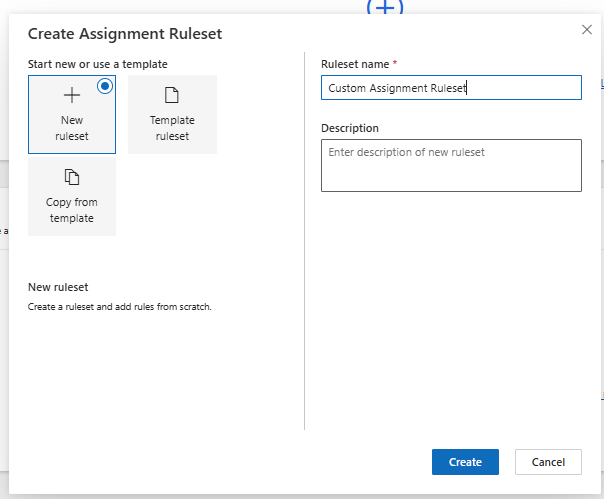
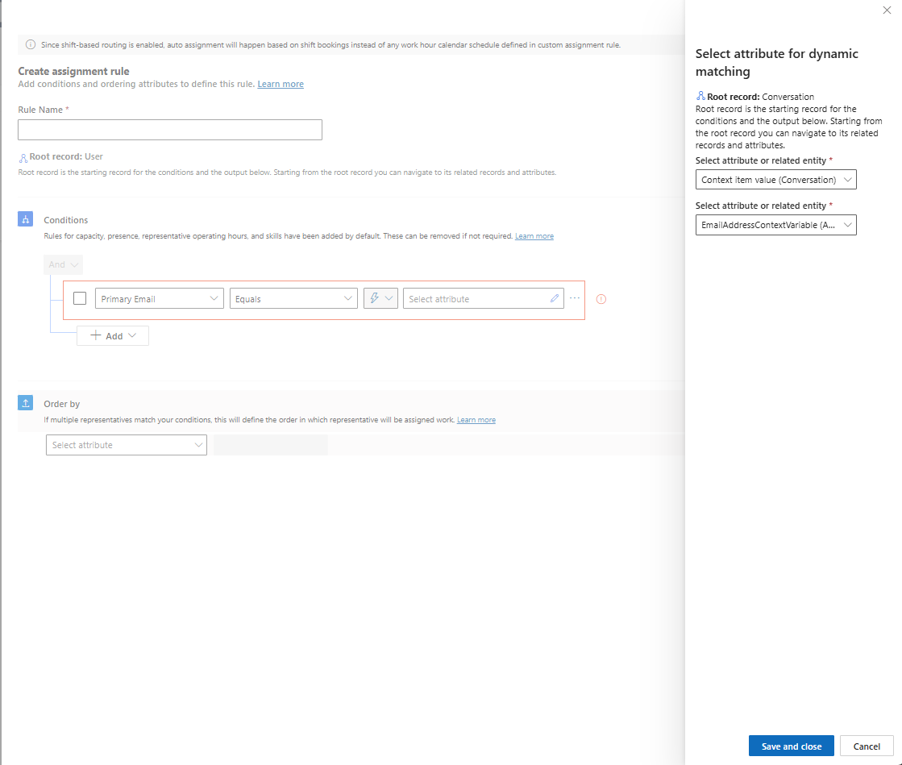
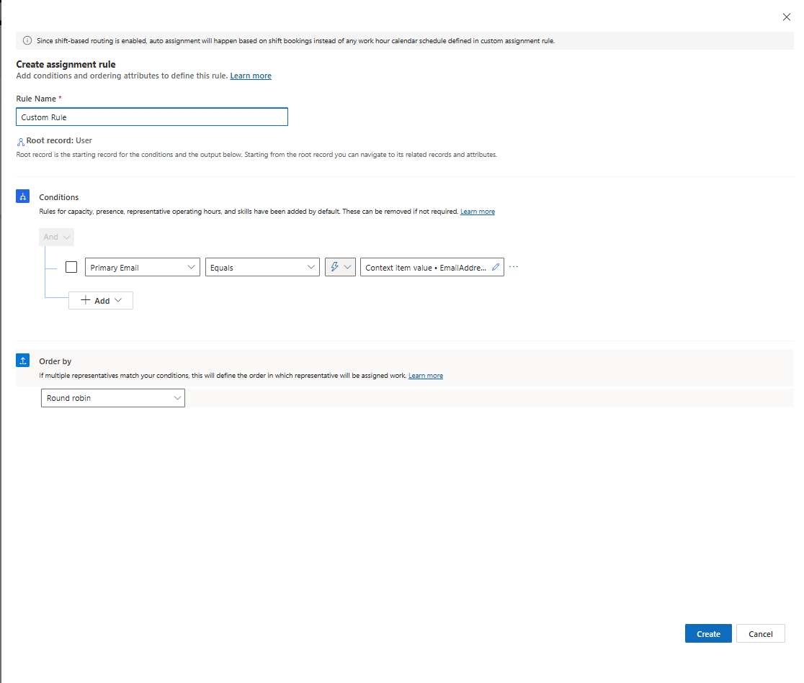
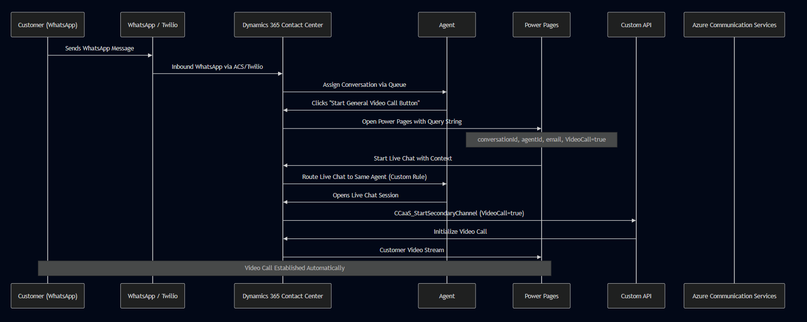

# D365 Contact Center to Video Call Escalation via WhatsApp, Live Chat & Power Pages

## Overview

This reference architecture describes a **real-time omnichannel escalation flow** where a customer initiates a conversation from **WhatsApp** connected through **Azure Communication Services (ACS)**, which is handled in **Dynamics 365 Contact Center**, and escalated into an **immediate video call** through **Live Chat** channel and **Power Pages**.

The solution enables:

- WhatsApp → Agent chat  
- Agent-triggered escalation to live chat  
- Automatic video call initiation using a **secondary channel**  
- **Targeted agent routing** via queue rules  
- Context-aware conversation handover  

This design is focused on **real production scenarios** for digital contact centers.

---

## Business Objective

Enable agents to **instantly escalate a WhatsApp text conversation into a video call**, without losing:

- Customer context  
- Agent assignment  
- Conversation history  

This is particularly useful for:

- Customer identity verification  
- High-value support scenarios  
- Complex troubleshooting  
- Assisted digital onboarding  
- Videocall with WebRTC

---

## High-Level Architecture

**Main Components:**

- WhatsApp Channel (Customer Entry Point)
- Dynamics 365 Contact Center
- Azure Communication Services / Twilio (Whatsapp)
- Power Pages (Middleware for handling WebRTC)
- Custom API for Secondary Channel Start
- Routing & Queue Rules

**Flow Summary:**

1. Customer sends a message from **WhatsApp**  
2. Message is processed by **Dynamics 365 Contact Center**  
3. Agent receives the conversation  
4. Agent clicks **"Start Video Call"**  with the Javascript in [Custom Video Call](./code/CustomVideoCall.js)
5. System sends a message to **Power Pages** with the following properties:

```json
{
  "ConversationId": "GUID",
  "AgentId": "AgentId",
  "EmailAddressContextVariable": "agent@company.com",
  "VideoCall": true
}
```

6. Power Pages initiates a **Live Chat session**  with the Javacript in the [Set Context Power Pages](./code/SetContextPowerPages.html)
7. Queue routing sends the session to the correct agent 
8. When the agent opens the live chat, `videoCall = true` triggers a **Custom API** call  
9. The `startSecondaryChannel` API starts the ACS video call **instantly**  with the Javascript [Conversation On Load](./code/ConversationOnLoad.js)

---

## 🔄 End-to-End Flow (Detailed)

### 1. Customer Entry via WhatsApp
- Customer initiates a WhatsApp conversation  
- Message is ingested by **Dynamics 365 Contact Center**

---

### 2. Agent Receives the Conversation
- Assigned automatically via queue routing  
- Agent accepts the WhatsApp chat inside Dynamics Customer Service Workspace  

---

### 3. Agent Triggers Video Escalation

A button in the agent UI sends a message with a link to the Power Pages where the Start Chat Set Context lives.
The link will be something like this: https://your-powerpages.powerappsportals.com/?conversationId=xxx2d15x-2703-xxea-xx80-xxxbfe13dd08&agentId=xxxx63bc-xxc2-fxx1-bbd3-xxx24xxce40f&email=x.xxx@xx.com

---

### 4. Power Pages Starts Live Chat
- Power Pages receives the query string and starts the chat with
```json
{
  "PreviousConversationId": "GUID",
  "EmailAddressContextVariable": "agent@company.com",
  "AgentId": "GUID",
  "VideoCall": true
}
```
- It establishes a new Live Chat session  
- Customer is seamlessly transferred into a **web-based chat experience**

---

### 5. Queue Routing Ensures Correct Agent Assignment

Routing rules match the agent via:

- `EmailAddressContextVariable`

---

### 6. On Load: Automatic Video Call Start
- When the agent opens the new live chat, the system reads `VideoCall = true`  
- A **Custom API** triggers:

```text
CCaaS_StartSecondaryChannel
```

---

### 7. Secondary Channel → Video Call Creation via ACS
- Video is initialized for both sides  
- Customer video interface loads inside Power Pages  
- The agent connects automatically from Dynamics 365  

**Result:**  
A seamless *WhatsApp → Chat → Video* customer journey with zero manual steps from the customer.

---

## Custom Rule Assignment

1. First we need to create the custom assignment inside the Queue.


2. We need to create our custom assignment ruleset.



3. We need to create a custom rule defining the email address and our custom variable we have set in the workstream


4. Final set of how this is going to show


---

## ✅ Benefits of This Architecture

- Zero context loss between WhatsApp and Video  
- Same-agent continuity  
- Fully automated video escalation  
- Multi-channel orchestration  
- Scales video through WebRTC

## Diagram



## 📎 Author

**Victor Sanchez**  
Solutions Architect & Team Lead @ Axazure

---
